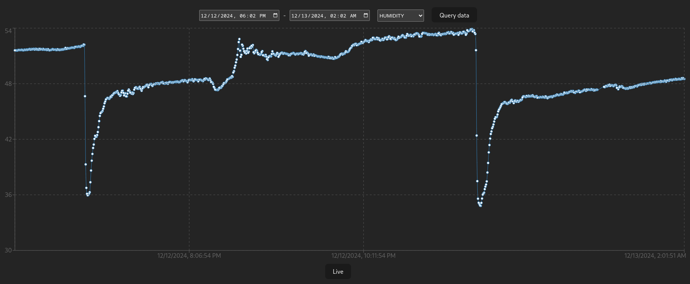
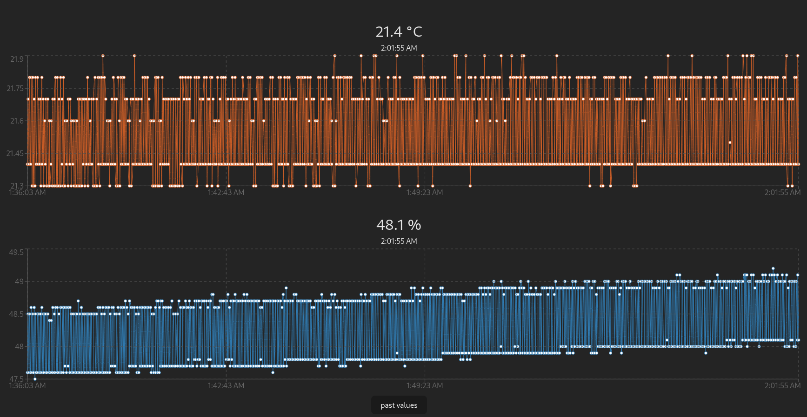
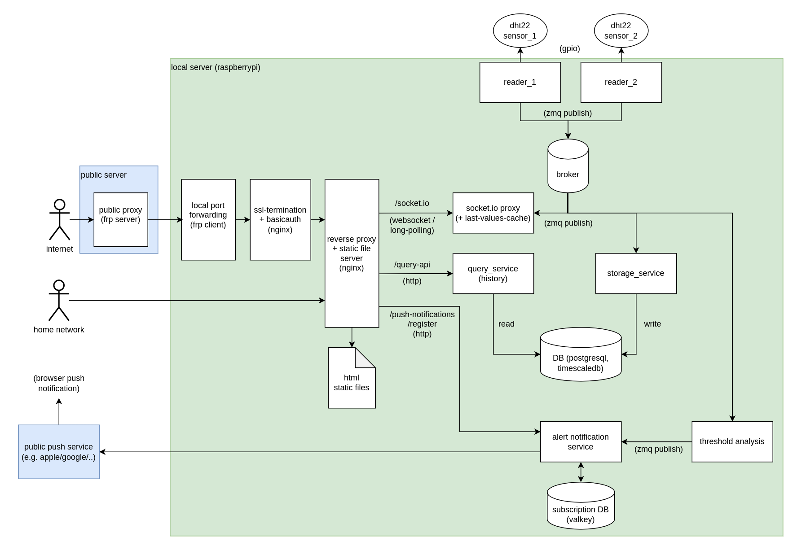

# DHT22 online hygrometer

capture, store and display humidity and temperature measurements from DHT22 sensors

## measurements history



## live values



## components



### sensor

2x DHT22, measurements of each sensor published every 2.5s via [zeromq](https://zeromq.org/)

### store

postgres with [timescaledb](https://www.timescale.com/) extension, accessed via python + sqlalchemy, schema management with [alembic](https://alembic.sqlalchemy.org/en/latest/), exposed via http, calculation of [time_buckets](https://docs.timescale.com/api/latest/hyperfunctions/time_bucket/) for long-term history queries, manual [backups](store/backup/notes.md)

### socket.io proxy

live updates via [socket.io](https://socket.io/) [python server](https://github.com/miguelgrinberg/python-socketio) (websocket / long-polling; including some recent values on connect)

### web-display

html charting frontend using react and [recharts](https://recharts.org/en-US/), showing live values and long-term history

### network access

local network: nginx static file server and reverse proxy

internet: nginx ssl-termination and basic-auth, [frp](https://github.com/fatedier/frp) for access via public server

## web-push-notifications

subscriptions are stored in valkey store

`source push_notification/server_3/vapid_keys.env`

## raspberrypi setup

prerequisites: raspbian, docker

```sh
# setup remote git repository on rpi
# https://stackoverflow.com/questions/4142936/git-clone-from-local-to-remote
# https://stackoverflow.com/a/26402690
# create empty repository on rpi:
git init --bare
# add as remote:
git remote add myrpi ssh://myrpiuser@myrpi/home/myrpiuser/myproject
# -> clone locally on remote
```

```sh
# gpio + other dependencies
sudo raspi-config nonint do_i2c 0
sudo raspi-config nonint do_spi 0
sudo raspi-config nonint do_serial_hw 0
sudo apt-get install -y i2c-tools libgpiod-dev python3-libgpiod
sudo apt-get install python3-dev
# basicauth password file creation:
sudo apt install apache2-utils
```

## tmux

```sh
# tmux
apt install tmux
tmux attach
# detach: ctrl + b, d
# new pane:
# - horizontally: C-b %
# - vertically: C-b "
# tiled layout: C-b M-5 (ctrl+b alt+5)
# close: C-b x
# tmux ls
# tmux attach -t 0
```

## start

```sh

# tmux, pane 1:
source push_notification/server_3/vapid_keys.env
docker compose up

# tmux, pane 2:
cd capture/sensor
source venv/bin/activate
export HYGRO_SENSOR_ID=dht22_1  # ... measure.py
python publish.py

```
